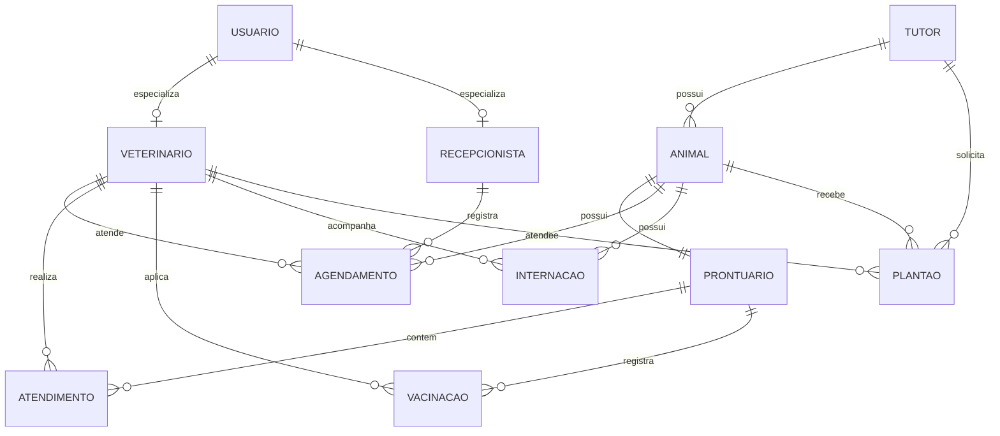

# DER — Pet & Gatô

## 1. Diagrama

# DER — Pet & Gatô

## 1. Diagrama

# Dicionário de Dados — Pet & Gatô

### Tabela: Usuario
| Campo | Tipo | Restrições | Descrição |
|---|---|---|---|
| Id_Usuario | INT | PK | Identificador único do operador/usuário no sistema |
| Nome_Usuario | VARCHAR(120) | NOT NULL | Nome completo do operador do sistema |
| Email_Usuario | VARCHAR(50) | NOT NULL, UNIQUE, CHECK | E-mail corporativo utilizado como login de acesso |
| Senha | VARCHAR(50) | NOT NULL, CHECK | Hash da credencial de autenticação de segurança |
| Perfil | VARCHAR(11) | NOT NULL, CHECK (Perfil IN('Recepcao', 'Veterinario')) | Define o perfil de privilégios de acesso do operador |

### Tabela: Veterinario
| Campo | Tipo | Restrições | Descrição |
|---|---|---|---|
| CRMV | INTEGER | PK | Número de registro no Conselho Regional de Medicina Veterinária |
| CNPJ | VARCHAR(18) | NOT NULL, CHECK | Cadastro Nacional da Pessoa Jurídica para emissão fiscal |
| Especialidade | VARCHAR(50) | NOT NULL | Área clínica de especialização do profissional |
| Id_Usuario | INT | FK -> Usuario.Id_Usuario, NOT NULL, UNIQUE | Vínculo 1:1 de especialização da entidade genérica Usuario |

### Tabela: Recepcao
| Campo | Tipo | Restrições | Descrição |
|---|---|---|---|
| Matricula | INT | PK | Número de matrícula funcional do colaborador da recepção |
| CPF_Recepcao | VARCHAR(14) | NOT NULL, CHECK | Cadastro de Pessoa Física do recepcionista |
| Id_Usuario | INT | FK -> Usuario.Id_Usuario, NOT NULL, UNIQUE | Vínculo 1:1 de especialização da entidade genérica Usuario |

### Tabela: Tutor
| Campo | Tipo | Restrições | Descrição |
|---|---|---|---|
| Id_Tutor | INT | PK | Identificador único do tutor/responsável legal pelo animal |
| Nome_Tutor | VARCHAR(120) | NOT NULL | Nome civil completo do tutor |
| CPF_Tutor | VARCHAR(14) | NOT NULL, UNIQUE, CHECK | CPF do tutor para faturamento e contratos de serviço |
| Email_Tutor | VARCHAR(50) | CHECK | E-mail de contato para comunicações e notificações clínicas |
| Telefone | VARCHAR(15) | NOT NULL | Telefone com DDD para contato de emergência e agendamentos |
| Observacoes | VARCHAR(300) | | Informações cadastrais adicionais ou preferências de contato |

### Tabela: Animal
| Campo | Tipo | Restrições | Descrição |
|---|---|---|---|
| Id_Animal | INT | PK | Identificador único do paciente veterinário |
| Id_Tutor | INT | FK -> Tutor.Id_Tutor, NOT NULL | Vínculo de propriedade com o tutor responsável |
| Nome | VARCHAR(30) | NOT NULL | Nome de identificação do animal |
| Tipo_animal | VARCHAR(15) | NOT NULL | Espécie do paciente (ex: Cão, Gato, Ave) |
| Raca | VARCHAR(35) | NOT NULL | Raça do paciente ou classificação SRD (Sem Raça Definida) |
| Sexo | CHAR | NOT NULL, CHECK (Sexo IN('M','F')) | Sexo biológico do animal |
| Data_nascimento | DATE | NOT NULL | Data de nascimento (ou estimada) para cálculo etário |

### Tabela: Prontuario
| Campo | Tipo | Restrições | Descrição |
|---|---|---|---|
| Id_Prontuario | INT | PK | Identificador único do prontuário médico do paciente |
| CRMV | INT | FK -> Veterinario.CRMV, NOT NULL | Veterinário responsável pela abertura do prontuário |
| Id_Animal | INT | FK -> Animal.Id_Animal, NOT NULL | Identificador do animal atendido (o tutor é derivado via 3FN) |
| Data_abertura | TIMESTAMP | NOT NULL, DEFAULT SYSDATE | Registro temporal de criação da ficha clínica |
| Peso_atual | NUMERIC(5,2) | NOT NULL, CHECK (peso_atual > 0) | Peso corporal aferido em quilogramas |
| Queixa | VARCHAR(300) | NOT NULL | Descrição do problema ou queixa principal informada pelo tutor |
| Anamnese | CLOB | | Histórico clínico detalhado levantado pelo veterinário |
| Diagnostico | VARCHAR(200) | NOT NULL | Parecer clínico, hipótese ou diagnóstico final estabelecido |
| Receita | VARCHAR(200) | | Prescrição médica, medicamentos e posologia indicada |
| Vacina | VARCHAR(200) | | Histórico e observações gerais do protocolo vacinal do paciente |

### Tabela: Agendamento
| Campo | Tipo | Restrições | Descrição |
|---|---|---|---|
| Hora_Agendamento | TIMESTAMP | PK | Data e horário reservados para o atendimento clínico |
| Id_Animal | INT | PK, FK -> Animal.Id_Animal, NOT NULL | Paciente agendado para o atendimento |
| CRMV | INT | PK, FK -> Veterinario.CRMV, NOT NULL | Médico veterinário escalado para a consulta |
| Matricula | INT | FK -> Recepcao.Matricula, NOT NULL | Operador de recepção responsável pelo registro da reserva |
| Status_Agendamento | VARCHAR(15) | NOT NULL, DEFAULT 'Agendado', CHECK (Status_Agendamento IN ('Agendado','Em Espera','Em Atendimento','Concluído','Cancelado')) | Estado operacional atual do agendamento |

### Tabela: Atendimento
| Campo | Tipo | Restrições | Descrição |
|---|---|---|---|
| Id_Atendimento | INT | PK | Identificador único da sessão pontual de atendimento |
| Id_Prontuario | INT | FK -> Prontuario.Id_Prontuario, NOT NULL | Vínculo com o prontuário histórico do paciente |
| Hora_Atendimento | TIMESTAMP | NOT NULL, DEFAULT SYSDATE | Marcação de início da consulta/procedimento clínico |

### Tabela: Vacinacao
| Campo | Tipo | Restrições | Descrição |
|---|---|---|---|
| Data_Aplicacao | TIMESTAMP | PK | Data e horário exatos da administração do imunizante |
| CRMV | INT | PK, FK -> Veterinario.CRMV, NOT NULL | Médico veterinário que administrou a vacina |
| Id_Prontuario | INT | FK -> Prontuario.Id_Prontuario, NOT NULL | Prontuário ao qual a vacinação fica registrada |
| Nome_Vacina | VARCHAR(30) | NOT NULL | Denominação comercial ou biológica da vacina |
| Lote_Vacina | VARCHAR(30) | NOT NULL | Número de lote para rastreabilidade sanitária |
| Data_Proxima_Dose | DATE | CHECK (data_proxima_dose > data_aplicacao) | Previsão temporal da próxima dose ou reforço anual |

### Tabela: Internacao
| Campo | Tipo | Restrições | Descrição |
|---|---|---|---|
| Id_Internacao | INT | PK | Identificador único do registro de internação |
| Id_Animal | INT | FK -> Animal.Id_Animal, NOT NULL | Paciente mantido em observação/leito hospitalar |
| CRMV | INT | FK -> Veterinario.CRMV, NOT NULL | Médico veterinário responsável pela internação |
| Data_Internacao | TIMESTAMP | NOT NULL, DEFAULT SYSDATE | Data e horário de admissão na ala de internação |
| Data_Alta | TIMESTAMP | CHECK (Data_Alta > Data_Internacao) | Data e horário de liberação do animal ou encerramento |
| Nivel_Gravidade | VARCHAR(10) | NOT NULL, CHECK (Nivel_Gravidade IN ('Baixa','Media','Alta','Critica')) | Classificação de risco/severidade do quadro clínico |
| Status_Internacao | VARCHAR(10) | NOT NULL, DEFAULT 'Internado', CHECK (Status_Internacao IN ('Internado','Alta','Obito')) | Situação do paciente durante o período internado |
| Evolucao_Internacao | CLOB | | Relatório contínuo de evolução clínica e parâmetros vitais |

### Tabela: Plantao
| Campo | Tipo | Restrições | Descrição |
|---|---|---|---|
| Id_Plantao | INT | PK | Identificador do atendimento emergencial/plantonista |
| Id_Animal | INT | FK -> Animal.Id_Animal | Paciente atendido (pode ser nulo caso animal não cadastrado) |
| Id_Tutor | INT | FK -> Tutor.Id_Tutor | Tutor que trouxe o animal no pronto atendimento |
| CRMV | INT | FK -> Veterinario.CRMV, NOT NULL | Veterinário plantonista responsável pela recepção clínica |
| Chegada_Plantao | TIMESTAMP | NOT NULL, DEFAULT SYSDATE | Registro temporal de entrada no setor de urgência |
| Status_Plantao | VARCHAR(10) | NOT NULL, DEFAULT 'Em análise', CHECK (Status_Plantao IN ('Em análise', 'Internado','Alta','Obito')) | Triagem e encaminhamento do caso na urgência |
| Evolucao_Plantao | CLOB | | Anotações médicas iniciais do atendimento em plantão |
